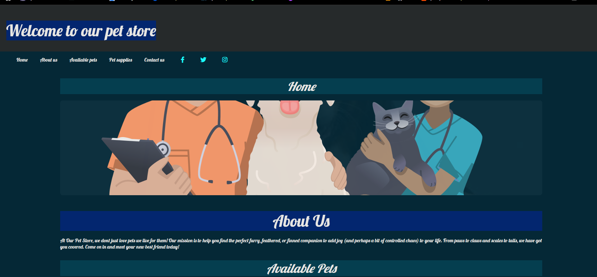
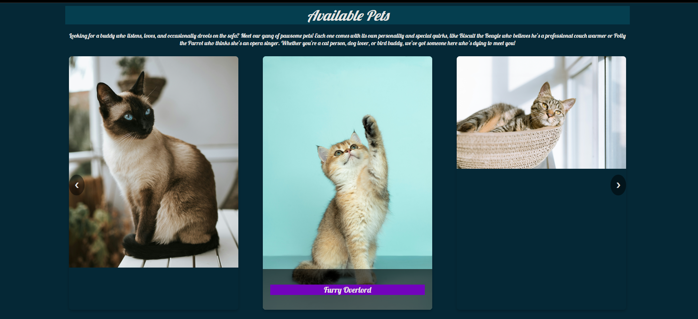
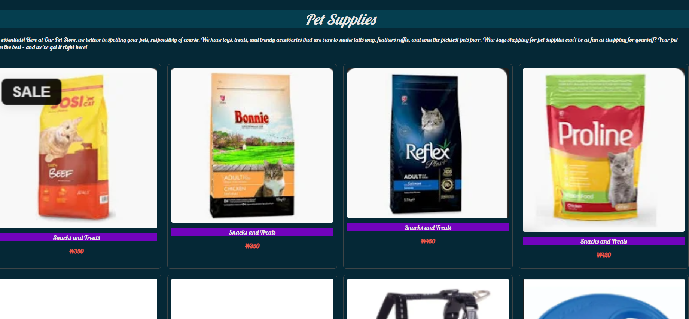
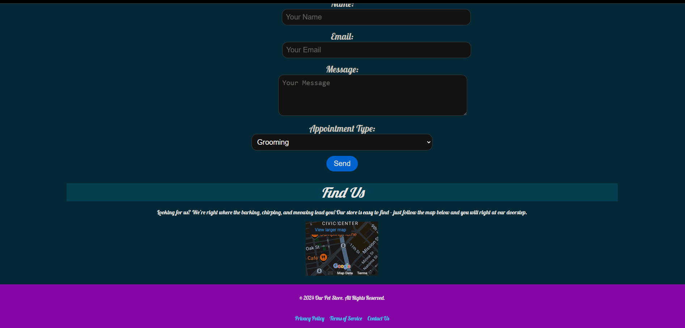

# pet-store-project
First week in SD class project to test my understanding on html,css and js
 The expectation is to test my understanding on:
  1. Understanding Basic HTML Document Structure
  2. Using Headings and Paragraphs
  3. Inserting Images
  4. Creating Links
  5. Building Lists
  6. Embedding Media (Optional for Audio/Video)
  7. Creating Forms
  8. Using Semantic HTML
  9. Embedding a Google Map
  10. Creating a Simple Table

With this the final product looks like this

* The Home page looks like this 

* The links of images

* the form and table

* The footer
